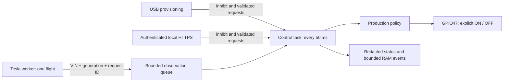

# Architecture and policy

One ESP-IDF C++ firmware, one laptop helper. There is no runtime laptop, broker,
telemetry receiver or third-party Tesla service. The documented S3R8's 8 MB octal PSRAM backs TLS allocations; control state and
task stacks stay internal, and missing/undersized PSRAM inhibits output. The
maintained trust bundle is from the pinned SDK; update the SDK deliberately when its trust roots/security
maintenance require it.

## Ownership and scheduling

`app_main` remains the sole GPIO owner, pinned to core 1. Wi-Fi and the initial
setup task run on core 0 so radio startup cannot monopolize the control core.
It initializes the inactive latch before
output enable, before creating setup/network tasks. It never waits for USB, DNS,
HTTPS, PBKDF2 or NVS commits. The 50 ms loop checks policy, handles OFF, writes the
GPIO, publishes a snapshot, then feeds its own three-second task watchdog. A
scheduling gap above 250 ms is a sticky local fault. The 100 ms requirement is a
normal-scheduling deadline; actual worst-case timing and watchdog behavior require
physical validation, and flash/cache stalls are not proven by compilation.
USB diagnostics retain the first local fault source, maximum control-loop gap,
allocation failure size, current/largest free internal heap, Wi-Fi station MAC and
assigned IP, gateway, resolver, SNTP enablement and UTC synchronization/readiness.
Only fixed diagnostic labels and non-secret connection metadata are
returned. The DHCP hostname is `smart-contactor`; this does not add mDNS service.

User OFF atomically inhibits output and advances the generation before persistence.
A single configuration writer commits OFF/AUTO/settings outside the control task.
If OFF supersedes a write, that writer persists DISABLED before releasing its lock.
No stale configuration or observation can clear the newer inhibit. An acknowledged
mode change is durable; power loss before an acknowledgement may leave the previous
record. A storage failure inhibits this boot and is reported, never silently erased.

VIN/home/settings changes clear all evidence and invalidate outstanding results.
Requests carry a monotonically increasing identity; duplicate or older responses
are rejected. The network worker checks generation again before a second request
or a 401 retry. There are no synthetic injection commands in production firmware.

## AUTO authorization

All defaults and validation live in `components/controller/include/policy.hpp`
and `policy.cpp`; `config.example.json` is a template with invalid placeholders.

| Input | Effect |
| --- | --- |
| Fresh valid fix ≤100 m | HOME latch; lease expires at source time +900 s, converted once to monotonic time |
| Fresh valid fix ≥200 m | Clear AUTO immediately, even while manually overridden |
| Fresh fix between radii | Retain the existing live latch; cannot establish an expired/uninitialized HOME latch |
| Explicit successful ASLEEP | Renew only a continuously live HOME lease from this boot/configuration, to min(now+900 s, last qualifying GPS source+24 h) |
| ONLINE alone, OFFLINE, errors, stale/null data | No renewal |
| Duplicate/source older than accepted fix | No renewal |
| Expiry | Clear latch; only a new fresh qualifying fix can reestablish permission |
| Revoked/missing authorization | Clear AUTO; timed override remains a distinct explicit authorization |

A new fix may be at most 120 seconds old or 30 seconds in the future. Tolerated
future timestamps get no bonus lease time. A general response timestamp is never
GPS freshness. Haversine distance clamps roundoff and handles the antimeridian.
No historical location can prove current physical presence; the sleep rule is an
explicit bounded compromise, not a proximity sensor.

SNTP is configured before Wi-Fi starts, then started/restarted after DHCP supplies
an IP address. This avoids carrying pre-connection DNS backoff into normal operation.
SNTP must synchronize before outbound TLS or accepting GPS. Leases, override,
dwell and retries use 64-bit monotonic milliseconds. A UTC discontinuity over 30
seconds clears AUTO; it does not extend any deadline. The onboard RTC is not trusted
or initialized. SNTP itself is unauthenticated; the local network/time source is
part of this hobby controller's trust boundary.

## Modes and output

- Provisioning always starts uncommissioned, DISABLED and dry-run. Only USB can
  commission or leave dry-run. Those operations still leave DISABLED selected.
- DISABLED is persistent and prevents AUTO and timed ON. Select AUTO explicitly
  before requesting an override. OFF cancels the override and invalidates evidence.
- TIMED_ON defaults to one hour, maximum eight. It bypasses Tesla but cannot bypass
  commissioning, DISABLED or critical faults. It is never persisted.
- AUTO continues to consume observations independently while overridden. Expiring
  an override retains ON if AUTO is still valid, without an OFF pulse.
- Every actual OFF transition starts a 30-second minimum OFF dwell. Boot begins a
  new dwell. Nothing postpones an OFF command. Dry-run reports desired authorization
  but always commands the physical relay OFF.

## Network and persistence

`FleetClient`, policy, parsers, session checks, budget and token journal are native
C++ with no ESP dependencies. Firmware supplies the TLS transport, monotonic/UTC
clock and NVS adapter. Native fake transports cannot be selected in firmware.

TLS requests have a 10-second connect budget, five-second no-progress budget and
20-second total deadline checked in the worker. Nonblocking reads/writes return to
that loop; one usable DHCP DNS server and IPv4 bound the SDK's underlying synchronous
DNS retry phase (pinned lwIP defaults, four attempts, approximately seven seconds).
Two SDK DNS slots are required: the final slot is reserved and remains unused with
fallback disabled. Configuring only one slot prevents DHCP from installing a resolver.
No request can keep the control task alive or renew a lease just by retrying.
Responses are capped at 16 KiB, JSON at depth 12/512 tokens, HTTP line at 1 KiB and
combined header/chunk metadata at 8 KiB. Close-delimited, length-delimited and chunked
responses work; ambiguous lengths, compression, oversize and truncation fail closed.

One coordinated refresh and one retry are allowed per 401 request. Billing,
permission, repeated 401, redirect and local-storage errors pause automatic polling.
Authenticated check-now may deliberately retry after backoff; revoked token journals
still require USB reauthorization. Backoff starts around 60 seconds, grows to an
hour, adds jitter, and honors bounded Retry-After seconds/HTTP dates. Check-now
cannot bypass backoff, a request in progress or budgets. Active credentials also
refresh before their `expires_in` deadline without moving the presence poll deadline.
DISABLED pauses API work; long disuse can require a new consent flow.

The journal writes refresh intent first, then the replacement token and previous
token together. Only a successful commit releases the new access token to callers.
Lost replies/reboots recover within the documented reuse window, at most three
attempts. Exhausted recovery, corruption, and permanent revocation are explicit
conditions. No failed initialization automatically erases credentials. A pending
USB transaction inhibits boot until explicitly reprovisioned.

Usage reserves blocks of four calls per endpoint before network attempts. A reboot
consumes leftover reservation credit, preventing cap evasion by repeated resets.
UTC day/month counters never roll backward. Estimates count failed attempts too.
VIN/home and policy changes do not reset accounting. The request caps are additional
local limits; Tesla billing remains authoritative.

## Local management boundary

The device serves only HTTPS `/`, `POST /api/login`, authenticated
`GET /api/status`, and authenticated/CSRF-protected `POST /api/action`.
Sessions use 256-bit random IDs, a Secure/HttpOnly/SameSite=Strict cookie, exact
configured Origin, an independent 256-bit CSRF token and a 15-minute monotonic
expiry. Login throttling increases to five minutes. Passwords are salted PBKDF2
SHA-256 (100,000 iterations). No state-changing GET, CORS, arbitrary GPIO, shell,
file endpoint or URL fetcher exists. UI text is rendered with `textContent`.

Only one administrator session exists; a new login replaces it. The browser stores
no tokens/passwords in localStorage/sessionStorage. Status deliberately contains
VIN/home settings for the authenticated owner but never Wi-Fi/Tesla credentials,
password hashes or private keys. Errors are fixed enums, not upstream bodies.
Status and USB diagnostics also retain the last Fleet endpoint, HTTP status and
a fixed parse-failure label. Missing/null GPS source time is distinguished from
invalid timestamp units and missing coordinates; no response values are logged.
A 16-entry RAM decision log is bounded and volatile. No unbounded flash logs,
recovery AP, BLE, RS485 controls, OTA or factory services are enabled.

USB physical access is privileged: explicit replacement provisioning can replace
all credentials without the previous password, just as physical reflashing could.
Normal USB mode/arm commands require the current administrator password. Provisioning
never echoes its input and always returns to DISABLED/uncommissioned/dry-run. Plain
NVS and unencrypted flash provide no defense against physical extraction. Do not
publish ports to the Internet; place the controller on a trusted LAN.
