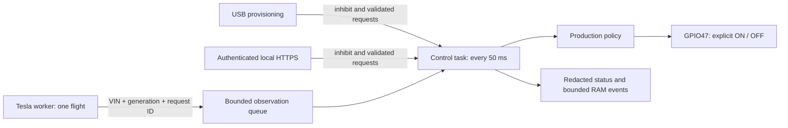

# Architecture and policy

One ESP-IDF C++ firmware, one laptop helper. There is no runtime laptop, broker,
telemetry receiver or third-party Tesla service. The documented S3R8's 8 MB octal PSRAM backs TLS allocations; control state and
task stacks stay internal, and missing/undersized PSRAM inhibits output. The
maintained trust bundle is from the pinned SDK; update the SDK deliberately when its trust roots/security
maintenance require it.

## Ownership and scheduling

```mermaid
flowchart LR
    T[Tesla worker: one flight] -->|VIN + generation + request ID| Q[Bounded observation queue]
    U[USB provisioning] -->|inhibit and validated requests| C[Control task: every 50 ms]
    W[Authenticated local HTTPS] -->|inhibit and validated requests| C
    Q --> C
    C --> P[Production policy]
    P --> G[GPIO47: explicit ON / OFF]
    C --> S[Redacted status and bounded RAM events]
```

`app_main` remains the sole GPIO owner, pinned to core 1. Wi-Fi and the initial
setup task run on core 0 so radio startup cannot monopolize the control core.
It initializes the inactive latch before
output enable, before creating setup/network tasks. It never waits for USB, DNS,
HTTPS, PBKDF2 or NVS commits. The 50 ms loop checks policy, handles OFF, writes the
GPIO, publishes a snapshot, then feeds its own three-second task watchdog. A
scheduling gap above 250 ms is a sticky local fault. The 100 ms requirement is a
normal-scheduling deadline; actual worst-case timing and watchdog behavior require
physical validation, and flash/cache stalls are not proven by compilation.
USB diagnostics retain the first local fault source, maximum control-loop gap,
allocation failure size, current/largest free internal heap, Wi-Fi station MAC and
assigned IP, gateway, resolver, SNTP enablement and UTC synchronization/readiness.
Only fixed diagnostic labels and non-secret connection metadata are
returned. The DHCP hostname is `smart-contactor`; this does not add mDNS service.

User OFF atomically inhibits output and advances the generation before persistence.
A `ControlEpoch` under the control lock owns this marker, seeded from the hardware
RNG at boot. Web/USB status returns it as `generation`; non-OFF mode/settings
commands carry the generation they observed before a dialog, password check or
network delay. Acquiring a change atomically compares and advances that generation;
stale requests cannot acquire OFF's newer generation. The boot profile likewise
keeps the generation captured before loading/validation. OFF is unconditional.
A single configuration writer commits OFF/AUTO/settings outside the control task.
If OFF supersedes a write, that writer persists DISABLED before releasing its lock.
No stale configuration or observation can clear the newer inhibit. An acknowledged
mode change is durable; power loss before an acknowledgement may leave the previous
record. A storage failure inhibits this boot and is reported, never silently erased.

VIN/home/settings changes clear all evidence and invalidate outstanding results.
Requests carry a monotonically increasing identity; duplicate or older responses
are rejected. The network worker checks generation again before a second request
or a 401 retry. There are no synthetic injection commands in production firmware.

## AUTO authorization

All defaults and validation live in `components/controller/include/policy.hpp`
and `policy.cpp`; `config.example.json` is a template with invalid placeholders.

`position_basis` chooses the evidence contract; it never changes automatically:

- `gps_source` is the default and preserves the original maximum GPS acquisition
  age requirement. The timestamp is `drive_state.gps_as_of`, in whole Unix seconds.
  Invalid or missing GPS time cannot authorize AUTO, even when coordinates and
  the general vehicle report timestamp are valid.
- `vehicle_report` is an explicit opt-in for latest reported position. It requires
  a successful ONLINE status check, valid returned coordinates and
  `drive_state.timestamp` in whole Unix milliseconds. Its age check establishes
  report freshness only. The coordinates may be older than that report; this
  policy does not preserve the original maximum GPS-age guarantee.

In the table, **evidence time** means GPS acquisition time in strict mode and
vehicle report time in report mode. Both require selected VIN, matching request
identity/configuration generation, valid coordinates and synchronized UTC. Neither
uses HTTP time or receipt time as a fallback. A negative `gps_as_of` remains a
diagnostic in report mode; it is never converted into a valid GPS time.

The following table describes the default `outage_policy=expire` behavior.

| Input | Effect |
| --- | --- |
| Fresh qualifying position ≤100 m | HOME latch; lease expires at evidence time +900 s, converted once to monotonic time |
| Fresh qualifying position ≥200 m | Clear AUTO immediately, even while manually overridden |
| Fresh qualifying position between radii | Retain the existing live latch; cannot establish an expired/uninitialized HOME latch |
| Explicit successful ASLEEP | Renew only a continuously live HOME lease from this boot/configuration, to min(now+900 s, last qualifying evidence time+24 h) |
| ONLINE alone, OFFLINE, errors, stale/null data | No renewal |
| Duplicate/evidence time older than accepted observation | No renewal |
| Expiry | Clear latch; only new fresh qualifying evidence can reestablish permission |
| Revoked/missing authorization | Clear AUTO; timed override remains a distinct explicit authorization |

By default, new evidence may be at most 120 seconds old or 30 seconds in the
future. The configurable source/report age range is 1–600 seconds. Tolerated
future timestamps get no bonus lease time. In report mode, the ordinary lease and
fixed sleep ceiling are anchored to the report timestamp, and duplicate or older
reports cannot renew them. These deadlines do not measure the GPS coordinates'
actual acquisition age. Whole report milliseconds are rounded down to seconds;
distinct reports within one second are conservatively treated as duplicates.
Haversine distance clamps roundoff and handles the
antimeridian. No historical location can prove current physical presence; report
mode and sleeping-home renewal are explicit compromises, not proximity sensing.

### Holding the last confirmed AUTO decision

`outage_policy=hold_last` is an explicit alternative to the expiry table above.
`Policy` keeps its independent geofence latch after the ordinary lease and sleep
ceiling pass. Missing results, OFFLINE, stale/malformed responses, transport/API
errors, backoff and caps cannot establish HOME or clear a confirmed HOME decision.
A newer admissible AWAY fix clears it immediately; hysteresis retains the latch in
the intermediate band. The source/report timestamp remains unchanged, the expired
lease has zero remaining time, and `auto_retained=true` / `auto_home_retained`
identify retained authorization instead of fresh evidence.

A UTC discontinuity keeps the confirmed decision in hold mode, but marks its lease
elapsed; synchronization and the original timestamp/identity/order checks remain
required before accepting another location. The default expiry mode still clears
AUTO on a clock discontinuity. No retry extends any evidence timestamp. Sleep
responses cannot create HOME after an unknown/AWAY decision or manufacture freshness.
A saved held HOME can restore permission independently of any sleeping response.

Explicit OFF, permanent authorization/permission loss and critical local faults
clear HOME in both modes. TIMED_ON remains volatile with its own deadline and
never creates a HOME latch; expiry returns to independently evaluated AUTO. Output
still obeys commissioning, dry-run, persisted DISABLED and minimum OFF dwell.
Configuration changes invalidate old/queued evidence in both modes.

Hold-last has **no maximum outage/sleep/cap hold duration**, so departure during an
outage can leave the outlet enabled indefinitely until fresh valid AWAY evidence
or operator/local inhibition. The scheduler, bounded retries, token refresh and
spending limits are unchanged. No additional paid requests or vehicle commands
are introduced. It is a charging-availability choice, not proof of physical
presence or an access-duration guarantee.

Default `expire` does not persist permission and requires new qualifying HOME
after reset. Explicit `hold_last` saves the independent AUTO HOME/AWAY decision in
a separate 32-byte versioned NVS blob, checked by CRC and bound to every setting
without relying on C++ padding. The timestamp saved at the decision transition is
an ordering watermark: it rejects reports older than or equal to that transition
after restoration, without a reusable lease or GPS-freshness claim. Same-state
polls update RAM timestamps without repeatedly writing flash.
Ordinary power/reset recovery starts OFF and restores saved HOME after the
configured minimum OFF dwell (at least 30 seconds), without requiring Wi-Fi/UTC.
Saved AWAY, unknown state, DISABLED, uncommissioned or dry-run output remains OFF.
A missing record means unknown; malformed/wrong-size/corrupt records fault OFF.
Watchdog, panic and unrecognized reset reasons durably clear saved permission and
require new HOME. A durable token revocation prevents restoring HOME offline.

A dedicated storage worker commits transitions outside the control task. New
held HOME cannot physically energize until its current-generation commit is
acknowledged; `auto_state_commit_pending` explains the inhibit. OFF/AWAY remain
immediate. Repeated polls/errors do not rewrite unchanged decisions. OFF/settings/
provisioning writers serialize with this worker and clear prior saved permission
before saving a profile. Late acknowledgements cannot defeat OFF or a new config.
`auto_restored` identifies historical boot restoration, while `auto_state_pending`
identifies an uncommitted transition. No coordinates, override or output command
are persisted in this record.

GPIO and flash cannot change atomically: a power cut before an OFF/AWAY commit
can retain the previously committed decision. Failed writes inhibit the current
boot; hardware testing must measure the actual commit/reset boundaries. Corrupt
records are not silently overwritten by runtime recovery; deliberate full USB
provisioning replaces the decision record while inhibiting output.

Config schema 3 uses byte 85 of the existing 88-byte record, formerly padding.
Schemas 1/2 always mean `expire` regardless of that byte. Saving settings migrates
legacy values explicitly and preserves the profile size, credential fields and
CRC coverage. Unsupported schemas are rejected; downgrading after a schema 3 save
stays OFF rather than interpreting held authorization as an expiring lease.

### Optional ten-minute profile

With `outage_policy=expire`, an explicitly selected profile uses `position_basis=vehicle_report`,
`max_age_s=600`, `lease_s=600` and `poll_s=540`. It retains the default radii,
30-second OFF dwell, fixed 24-hour sleeping-home ceiling and request caps.
Factory defaults and `config.example.json` remain strict `gps_source`; a strict
ten-minute alternative uses the same numeric profile with that basis.

In the selected profile, fresh ONLINE status plus valid HOME coordinates and a
valid `drive_state.timestamp` vehicle report can authorize AUTO even when
`gps_as_of` is negative. Negative GPS remains a visible diagnostic and is not
converted into a plausible GPS acquisition time. The lease expires at report time
plus 600 seconds; an eight-minute-old report can establish only its remaining two
minutes, never ten new minutes from receipt. At report age 600 seconds there is
no remaining authorization. A duplicate/older report, errors and ONLINE status
alone cannot extend the deadline. A newer valid reported AWAY position clears
AUTO immediately. Explicit ASLEEP can renew only continuously live HOME permission,
for at most 600 seconds from that status observation and never beyond the fixed
sleeping-home ceiling measured from the last qualifying report.

Coordinates can be older than the report. A new report can renew HOME even if
GPS acquisition time did not advance; this is the deliberate difference from
strict GPS mode. A current report with cached HOME coordinates, or erroneous
ASLEEP state, can keep authorization while the vehicle is actually away. The
profile therefore CANNOT guarantee cutoff within ten minutes of physical departure.
With no new qualifying HOME report or ASLEEP evidence, permission expires within
600 seconds of the last qualifying renewal. In strict mode the same bound is
anchored to GPS source time, and repeated GPS fixes cannot renew it.

Nine-minute polling leaves about one minute for report/source age and
request/scheduling latency when selected evidence is fresh. Old evidence or slow
calls can still make power turn OFF between polls; continuity is subordinate to
authorization expiry. Reboot/expiry require new qualifying location evidence;
ASLEEP cannot restore an expired or uninitialized HOME latch. Do not automatically
switch timestamp basis or add unbounded grace periods. An explicit TIMED_ON is a
separate owner-authorized presence bypass and is not subject to this access target.
At the intended 240 V / 16 A load, ten minutes is 0.64 kWh before charging losses.

At the reviewed $0.002 Data rate, continuous ONLINE polling every 540 seconds uses
4,960 calls in a 31-day month ($9.92 before discounts), leaving little headroom
under the 5,000-reservation cap. Tesla currently supplies a $10 monthly discount
for individual developers/small applications. Sleep skips paid live-data calls;
failed attempts, manual checks and reboot reservation losses can exhaust the cap
sooner. Exhaustion stops renewal rather than extending access. No polling-rate
increase or budget increase accompanied report-mode selection. Other applications
can consume the account discount; Tesla billing remains authoritative. See
[Tesla pricing](https://developer.tesla.com/) and
[billing/discount](https://developer.tesla.com/docs/fleet-api/billing-and-limits).

Use firmware that supports a 600-second maximum age. Older images may reject
that setting. Application OTA is available after the explicit [USB layout migration](ota.md). Changing basis is authenticated, clears old evidence/overrides and
fences outstanding results; it does not bypass the existing scheduler embargo.

New configuration records use schema 3. The record remains 88 bytes; a schema 1
record is interpreted as strict `gps_source`, ignoring the bytes that were padding
in that schema. Authenticated Settings validates the basis and changing it clears
leases, overrides and old-generation responses. Once a newer configuration schema is saved,
older firmware rejects that unsupported configuration and remains OFF; it does
not erase credentials. Do not downgrade expecting a newer schema to be understood.

SNTP is configured before Wi-Fi starts, then started/restarted after DHCP supplies
an IP address. This avoids carrying pre-connection DNS backoff into normal operation.
SNTP must synchronize before outbound TLS or accepting position evidence. Leases, override,
dwell and retries use 64-bit monotonic milliseconds. A UTC discontinuity over 30
seconds clears AUTO in expiry mode and marks retained HOME stale in hold mode; it does not extend any deadline. The onboard RTC is not trusted
or initialized. SNTP itself is unauthenticated; the local network/time source is
part of this hobby controller's trust boundary.

## Modes and output

- Provisioning always starts uncommissioned, DISABLED and dry-run. Only USB can
  commission or leave dry-run. Those operations still leave DISABLED selected.
- DISABLED is persistent and prevents AUTO and timed ON. Select AUTO explicitly
  before requesting an override. OFF cancels the override and invalidates evidence.
- TIMED_ON defaults to one hour, maximum eight. It bypasses Tesla but cannot bypass
  commissioning, DISABLED or critical faults. It is never persisted.
- AUTO continues to consume observations independently while overridden. Expiring
  an override retains ON if AUTO is still valid, without an OFF pulse.
- Every actual OFF transition starts a 30-second minimum OFF dwell. Boot begins a
  new dwell. Nothing postpones an OFF command. Dry-run reports desired authorization
  but always commands the physical relay OFF.

## Network and persistence

`FleetClient`, policy, parsers, session checks, budget and token journal are native
C++ with no ESP dependencies. Firmware supplies the TLS transport, monotonic/UTC
clock and NVS adapter. Native fake transports cannot be selected in firmware.

TLS requests have a 10-second connect budget, five-second no-progress budget and
20-second total deadline checked in the worker. Nonblocking reads/writes return to
that loop; one usable DHCP DNS server and IPv4 bound the SDK's underlying synchronous
DNS retry phase (pinned lwIP defaults, four attempts, approximately seven seconds).
The initial SDK call also contains a synchronous socket select: it cannot be
preempted by the application deadline. Completion after the connect budget is
rejected before any HTTP write; these finite operations remain off the control
task. Thus the budgets are checks, not an exact wall-clock cancellation guarantee.
Two SDK DNS slots are required: the final slot is reserved and remains unused with
fallback disabled. Configuring only one slot prevents DHCP from installing a resolver.
No request can keep the control task alive or renew a lease just by retrying.
The control task keeps checking its existing monotonic lease after Wi-Fi loss,
while new location evidence and TLS requests wait for a fresh SNTP sync after
the next IP connection. DHCP address loss also clears readiness. An NTP-only
outage inhibits new evidence/TLS after six hours without synchronization;
`utc_sync_age_s` uses wrapping unsigned uptime seconds. Existing monotonic
deadlines remain unchanged. A clock discontinuity clears AUTO in expiry mode;
hold mode retains its confirmed decision and marks it stale.
Responses are capped at 16 KiB, JSON at depth 12/512 tokens, HTTP line at 1 KiB and
combined header/chunk metadata at 8 KiB. Close-delimited, length-delimited and chunked
responses work; ambiguous lengths, compression, oversize and truncation fail closed.

Diagnostics retain a bounded, character-allowlisted `x-txid` and HTTP `Date`, the
local response-completion UTC, optional numeric `response.api_version` and original
`drive_state.timestamp` numeric text. Duplicate or unsafe diagnostic headers are
omitted; they never change response acceptance. These fields reset per response,
are exposed through authenticated status/physical USB. Only the deliberately
selected timestamp field can participate in HOME authorization; HTTP metadata and
local receipt time cannot. `drive_state.timestamp` is diagnostic-only under strict
`gps_source` and is validated separately as report time under `vehicle_report`.
Authenticated status separately reports the distance from
the numeric/range-valid returned coordinates to configured home, even when the
source timestamp is invalid. This diagnostic distance is explicitly freshness
unverified; it never changes the AUTO latch or policy distance. Raw coordinates
are not added to status or logs. No arbitrary headers or response bodies are logged.
The worker checks generation again after each status/location response. Network
status publishing is generation-fenced and paused while DISABLED, so OFF preserves
the last completed diagnostic without applying a late response. Re-entering AUTO
or changing VIN/home clears the old reported position before new polling. Durable
reauthorization-required state remains visible even after a DISABLED reboot.

One coordinated refresh and one retry are allowed per 401 request. Billing,
permission, repeated 401, redirect and local-storage errors pause automatic polling.
Only a billing pause automatically resumes at a newer synchronized UTC billing
month, still respecting Retry-After and local caps. Other permanent pauses stay
paused. The worker observes calendar changes without making a network request.
Authenticated check-now may deliberately retry after backoff and has a 10-minute
cooldown. Revoked token journals still require USB reauthorization. Backoff starts
around 60 seconds, grows to an
hour, adds jitter, and honors bounded Retry-After seconds/HTTP dates (parsed
as UTC regardless of device timezone). Check-now
cannot bypass backoff, a request in progress or budgets. Active credentials also
refresh before their `expires_in` deadline without moving the presence poll deadline.
DISABLED pauses API work; long disuse can require a new consent flow.

The journal writes refresh intent first, then the replacement token and previous
token together. Only a successful commit releases the new access token to callers.
Lost replies/reboots recover within the documented reuse window, at most 32
attempts. A DNS/TLS/connection failure before the first HTTP write cannot have
rotated the token: a checked commit restores the intent metadata from before that
attempt. Any earlier uncertainty retains its original counter and 24-hour ceiling.
Transport results default to possibly sent; production changes that flag before
the first write, so partial writes, timeouts after transmission and HTTP errors
retain bounded ambiguous recovery. A failed restore is a critical storage fault.
Exhausted recovery, corruption, and permanent revocation are explicit
conditions. No failed initialization automatically erases credentials. A pending
USB transaction inhibits boot until explicitly reprovisioned. Replacement USB
provisioning holds the same configuration mutex across pending marker, token,
profile and completion marker writes, so a concurrent OFF cannot overwrite new
credentials with an old profile. Provisioning is marked atomically with output
inhibition before the network worker is drained.

Usage reserves blocks of four calls per endpoint before network attempts. A reboot
consumes leftover reservation credit, preventing cap evasion by repeated resets.
UTC day/month counters never roll backward. Estimates count failed attempts too.
Separate saturating RAM counters report actual transport attempts per endpoint in
the current boot, including 401 retries and failures but excluding requests refused
by the budget or storage checks. They do not replace durable budget reservations.
VIN/home and policy changes do not reset accounting. The request caps are additional
local limits; Tesla billing remains authoritative. A fixed 5,000-reservation cap
on monthly live-data requests matches $10 at the published $0.002 Data price.
Before each poll, the client checks this cap so it sends no status, live-data or
poll-time refresh request once the monthly live-data allowance is spent. A separate
unbilled token refresh may still maintain the device-owned token chain. Budget failures
cannot renew a sleeping-home lease. Default expiry commands OFF; hold-last
retains the confirmed decision without spending above the cap. On the
next UTC month, the budget can resume without clearing stored account records.

## Local management boundary

The device serves only HTTPS `/`, `POST /api/login`, authenticated
`GET /api/status`, and authenticated/CSRF-protected `POST /api/action`.
Sessions use 256-bit random IDs, a Secure/HttpOnly/SameSite=Strict cookie, exact
configured Origin, an independent 256-bit CSRF token and a 15-minute monotonic
expiry. Login throttling increases to five minutes. The v2 password record stores
SHA-256 of a domain-separated, salted PBKDF2-SHA-256 result (100,000 iterations).
The browser derives the PBKDF2 result using Web Crypto and sends it over trusted
HTTPS; the ESP32 checks the verifier quickly. That transmitted result is a reusable
password equivalent, so TLS certificate validation and secret handling remain
essential. The first successful login to a v1 record atomically commits a v2
profile without changing the user's password or Tesla token. USB password checks
still perform PBKDF2 on the device. The HTTPS raw-password path is accepted only
while a v1 record needs migration; a v2 profile rejects it before starting the
costly device-side PBKDF2 computation. A single bounded password-verification task uses
ESP-IDF asynchronous requests; a concurrent login is throttled. Completion returns
to the HTTP server task, which exclusively owns session/cookie state. An existing
administrator session can issue OFF during password verification. Password buffers
are wiped after verification. Temporary login-request/task allocation failure
returns 503 and releases the request; cleanup/dispatch or storage failure still
inhibits output. The global allocation hook records diagnostics rather than
classifying every failed TLS connection as a control fault. Essential startup,
control/task, GPIO and storage failures remain critical. The pinned HTTPS server
has a maintained cleanup patch for a post-handshake allocation failure; bootstrap,
CI and the target build check that it is applied. No TLS validation is relaxed.
No state-changing GET, CORS, arbitrary GPIO, shell,
file endpoint or URL fetcher exists. UI text is rendered with `textContent`.
`POST /api/action` requires a current `generation` for AUTO, timed ON, settings and
check-now; stale/missing markers return 409. OFF and logout remain usable without
one. The UI carries the snapshot generation through its confirmation dialog and
does not automatically retry a rejected action with a newer generation.

Only one administrator session exists; a new login replaces it. The browser stores
no tokens/passwords in localStorage/sessionStorage. Status deliberately contains
VIN/home settings for the authenticated owner but never Wi-Fi/Tesla credentials,
password hashes or private keys. Errors are fixed enums, not upstream bodies.
Status and USB diagnostics also retain the last Fleet endpoint, HTTP status and
a fixed parse-failure label. Missing/null GPS source time is distinguished from
invalid timestamp units and missing coordinates. The numeric GPS source field is
available as `gps_source_value` in RAM diagnostics (`-1` before a numeric source
has been parsed). `gps_source_text` preserves at most 63 characters of the original
JSON number token, before numeric conversion, or an empty string if unavailable.
Only validated numeric grammar is copied; coordinates, string values and arbitrary
upstream text remain excluded.
In strict mode, whole GPS seconds encoded with decimal/exponent notation retain the same source
value and lease deadline. Missing or unusable GPS source time reports
`gps_source_time_unusable`, distinct from malformed JSON/coordinates. Successful
normalization reports `gps_as_of_numeric_seconds`; fractional values,
millisecond-scale values and non-numeric types remain rejected.
The last explicit vehicle-status result is displayed independently of evidence
acceptance. ONLINE alone never establishes HOME. Invalid GPS time blocks strict
mode; report mode instead requires its selected report timestamp and the explicit
ONLINE check, and retains the raw GPS value for diagnostics. The dashboard labels
the selected basis and report age without claiming verified GPS freshness.
A 16-entry RAM decision log is bounded and volatile, available to authenticated
owners through `/api/events`, newest first. Status includes the remaining session
time, fixed fault metadata, control-loop gap, free internal heap and build versions.
Logout clears the server session and cookie even during a local recovery fault.
Truncated status construction returns 503 rather than malformed successful JSON.

HTML, JavaScript and CSS are separate embedded same-origin assets. CSP permits
scripts/styles only from this device, without inline execution. Browser countdowns
use elapsed monotonic time from a snapshot; they neither query Tesla nor claim
live command feedback. Settings drafts survive refresh. Expiry/sign-out clears
private page fields. OFF supersedes older pending UI results and is available in
confirmation dialogs. The report export uses a field allowlist excluding vehicle
identity, coordinates and all credentials. Host-only browser fixtures never enter
the firmware build or production transport.

The log remains bounded and volatile. No unbounded flash logs,
recovery AP, BLE, RS485 controls or factory services are enabled. Authenticated
local application OTA is described in [ota.md](ota.md).

For diagnostic observation, `tools/observe_controller.py` can sample authenticated
local status/events onto a computer. It has an explicit local route allowlist,
per-device certificate validation, secret/identity field exclusion, bounded reply
and file sizes, a finite capture window and transient-failure backoff. It continues
recording across mode/generation changes and apparent reboots rather than changing
the controller. Its only POSTs are local login and session logout; no Fleet request,
check-now, output or settings operation is available. The computer is optional and
must remain awake for capture; control remains entirely on the ESP32. This observer
shares the existing single admin session and can sign out the dashboard when it
reauthenticates. See [observation recording](observation.md) for commands and limits.

USB physical access is privileged: explicit replacement provisioning can replace
all credentials without the previous password, just as physical reflashing could.
Normal USB mode/arm commands require the current administrator password. Provisioning
never echoes its input and always returns to DISABLED/uncommissioned/dry-run. Plain
NVS and unencrypted flash provide no defense against physical extraction. Do not
publish ports to the Internet; place the controller on a trusted LAN.
Authenticated USB Wi-Fi recovery requires DISABLED already saved before the request.
It inhibits output, waits for an in-flight Fleet request, then changes only the
SSID/password in one checked profile commit. It preserves Tesla tokens, TLS keys,
commissioning and dry-run, and reboots DISABLED; AUTO must be selected again.
USB hello reports protocol 2. AUTO, timed ON, arm, enable-output and Wi-Fi recovery
require the generation captured by the helper before hidden credential prompts.
Old helpers are rejected safely; OFF/status/diagnostics retain their prior schema
with the additive status generation. The helper treats negative/missing action
acknowledgements as failures and rejects JSON numbers overflowing to infinity.

## Firmware updates

`FirmwareUpdate` is the bounded native transfer guard; `main/ota.cpp` owns the
ESP-IDF flash adapter and startup confirmation. It uses a separate worker, one
4 KiB RAM buffer and strict upload offsets. The existing authenticated HTTP task
accepts commands/chunks; only the control task commands GPIO47. An atomic
maintenance gate inhibits output without replacing AUTO state, and Policy sees
the gate so abort recovery observes actual continuous OFF dwell. OFF/configuration
generation changes cancel a transfer even after signature verification or boot
selection. A failed boot selection is treated as an ambiguous commit and restores
the running partition; a failed restoration raises a critical fault. The worker
never feeds the control watchdog. Polling pauses through updates and startup
confirmation; token/NVS rollback is never performed.

NVS/PHY offsets are unchanged. `otadata` occupies the existing gap at 0x21000;
`ota_0` begins at the original 0x30000 app address and `ota_1` at 0x330000. Both
slots are 3 MiB and the configured flash remains 8 MiB. Official RSA signed-on-
update checks and bootloader rollback are enabled; hardware secure boot,
anti-rollback eFuses and automatic build signing are disabled. The local helper
signs deployment bytes after building so no private key is needed in source or
CI. See [OTA procedures and limitations](ota.md).
